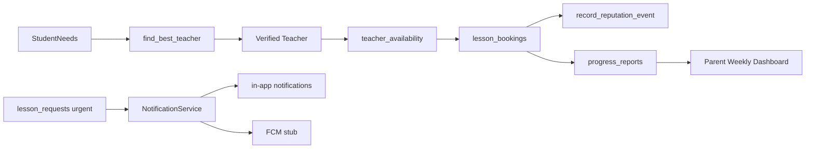

# Zigo Education Ecosystem — Master Plan

> **Kaynak gerçeği:** `supabase/migrations/066_education_ecosystem.sql`  
> **Referans şema:** `prisma/schema.prisma` (Prisma Client kullanılmaz)  
> **Domain:** `src/lib/domain/ecosystem/`

## Modül haritası

| Modül | Tablolar / RPC | Domain | API |
|-------|----------------|--------|-----|
| Güven Puanı | `users.reputation_score`, `reputation_events`, `record_reputation_event` | `ecosystem/reputation.ts` | (RPC via domain) |
| Akıllı Takvim | `teacher_availability`, `lesson_bookings`, `book_availability_slot` | `ecosystem/calendar.ts` | `/api/ecosystem/availability`, `/api/ecosystem/bookings` |
| Matching | `student_needs`, `find_best_teacher` | `ecosystem/matching.ts` | `/api/ecosystem/matching` |
| Veli Raporlama | `progress_reports`, `get_parent_weekly_progress_summary` | `ecosystem/reporting.ts` | `/api/ecosystem/progress/weekly` |
| Acil Destek | `lesson_requests.priority`, `lesson_request_urgent` notification | `ecosystem/notification-service.ts` | `/api/lesson-requests` (`priority: urgent`) |

## Veri akışı

## Rol kuralları

- **Öğretmen:** slot oluşturur, booking durumunu günceller, progress report ekler (atanmış alan).
- **Veli:** açık slotları görür, `book_availability_slot`, acil/normal ders talebi, haftalık özet.
- **Öğrenci:** `student_needs` (kendi hesabı), matching sonuçlarını görür; booking/talep oluşturamaz.

## Migration 067 — Booking lifecycle

- `complete_lesson_booking` → reputation + progress report atomically
- `cancel_lesson_booking` → frees availability slot (parent or teacher)

1. Migration 066 uygula (`npm run migrations:recent`)
2. Takvim + booking UI (öğretmen slot, veli rezervasyon)
3. Matching UI (veli/öğrenci ihtiyaç formu + öğretmen önerisi)
4. Booking tamamlanınca reputation + progress report otomasyonu
5. Push entegrasyonu (urgent lesson requests)

## Güvenlik

- RLS tüm yeni tablolarda aktif.
- Öğrenci DM yok; lesson_requests mesajlaşması kabul sonrası veli↔öğretmen.
- `reputation_events` insert yalnızca `record_reputation_event` RPC ile.
